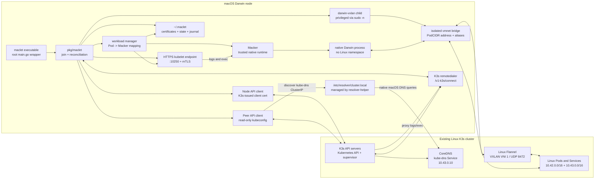

# maclet architecture

maclet is a Darwin node agent for an existing Kubernetes/K3s cluster. It lets
an Apple Silicon Mac participate in scheduling, networking, workload status,
logs, and exec without pretending that a native macOS process is an isolated
Linux container.

The repository currently builds one `maclet` executable. The root `main.go` is
only a process-exit wrapper; the implementation is in `pkg/maclet`, and the
small Kubernetes HTTP transport and upstream API type aliases are in `pkg/kube`.
maclet intentionally uses a narrow Kubernetes API client instead of
`client-go`.

## Runtime topology



## Components

### `maclet`

The command-line entry point and node daemon. A long-running `join` performs
these responsibilities:

- bootstraps K3s credentials and persists them under `~/.maclet`;
- creates or reconciles the Darwin `Node` and its `kube-node-lease` Lease;
- waits for the assigned PodCIDR;
- starts and supervises `darwin-vxlan`;
- publishes Flannel node annotations;
- configures the macOS cluster DNS resolver;
- reconciles opted-in Pods through Macker;
- serves the kubelet logs/exec endpoint; and
- drains workloads and cleans up owned state during graceful shutdown.

The daemon runs as the invoking user whenever passwordless `sudo -n` is
available. On a new state directory, its default Node name is derived from the
local macOS hostname and normalized to a Kubernetes-compatible DNS name. An
explicit `--node-name` overrides that value; when existing state is reused,
the persisted Node name is retained and an explicit name must match it. Only
operations that need host privileges are elevated:

- `darwin-vxlan` startup;
- route, ARP, and address operations; and
- the resolver helper that writes `/etc/resolver/cluster.local`.

### `darwin-vxlan`

The separate Rust process provides the Flannel-compatible L2 transport over
macOS vmnet. maclet supplies:

- VNI `1`;
- UDP port `8472`;
- MTU `1450`;
- the Mac underlay address;
- the assigned Darwin PodCIDR bridge address; and
- repeated PodCIDR-to-underlay peer mappings.

The Mac-side bridge name is discovered from vmnet and remains an implementation
detail. It is not derived from the PodCIDR.

The tunnel sends known unicast frames to the peer selected by destination
CIDR/MAC and fans out only broadcast, multicast, unknown, or otherwise
unmapped traffic. maclet creates one synthetic gateway and ARP entry per Linux
peer. The Service CIDR and unknown fallback use the configured
`--vxlan-remote` peer.

### `macker`

Macker is the trusted native workload runtime. maclet launches it with an
external network configuration:

- a direct PodCIDR address alias on the VXLAN bridge;
- the bridge interface and gateway metadata;
- image environment and Kubernetes container configuration;
- optional hostPath-backed mounts; and
- published ports, which use per-workload Macker node ports and PF redirects
  by default.

Macker starts ordinary macOS processes. It does not provide a Linux namespace,
filesystem, capability, or security boundary.

### Kubernetes API clients

maclet maintains two distinct API identities:

1. **Node client** — the K3s-issued client-kubelet certificate for the registered
   `system:node:<name>` identity. It handles Node/Lease heartbeats, the assigned
   Pod list, scoped Pod status updates, and kubelet bootstrap material.
2. **Peer client** — a separately configured kubeconfig identity used for
   read-only Flannel peer discovery and the cluster DNS Service. The same
   identity can optionally perform narrowly scoped stale native-Pod cleanup.

The restricted node identity is not granted broad permission to list arbitrary
Nodes or delete Pods.

## Join and bootstrap sequence

1. Read a K3s token from `--token`, `--token-file`, or stdin.
2. Choose the explicit `--node-name`, the persisted state name, or a
   Kubernetes-compatible form of the local hostname.
3. Fetch `/cacerts` and validate the token's CA hash.
4. Authenticate to K3s agent endpoints using HTTP Basic auth as user `node`.
5. Generate or reuse the persisted per-node password and client key material.
6. Request a K3s client-kubelet certificate and persist the resulting state.
7. Create or reconcile the Darwin/arm64 Node and retain its assigned PodCIDR.
8. Start the VXLAN transport, install Darwin routes/ARP state, and publish
   Flannel annotations.
9. Discover the `kube-dns` Service and install the macOS resolver file when
   resolver integration is enabled.
10. Start the kubelet HTTPS endpoint and one remotedialer tunnel per discovered
    K3s API server.
11. Begin the ten-second Node/Lease/Pod/network reconciliation loop.

A subsequent join must reuse the original state directory. K3s stores only a
hash of the node password, so deleting local state without deleting the
corresponding Node and node-password Secret prevents rejoining the same name.

## Networking model

For an assigned Darwin PodCIDR such as `10.42.8.0/24`, maclet reserves:

- `10.42.8.0` — network address;
- `10.42.8.1` — VXLAN bridge address; and
- `10.42.8.2` and other peer-specific synthetic gateways.

Native workload aliases start at the next available address, normally
`10.42.8.3`. These aliases are host-level addresses on the shared Darwin
network stack. They are not network namespaces or independently isolated
interfaces.

The Linux peers learn the Darwin PodCIDR and VTEP through the Flannel
annotations published on the Node. maclet learns Linux peer PodCIDRs,
underlay addresses, and VTEP MACs from the peer API client and passes those
mappings to darwin-vxlan. Multi-peer routing is destination-specific; it is not
blind frame replication.

The Service CIDR route allows native workloads and the Mac itself to reach
ClusterIP Services, including CoreDNS. Traffic still traverses the Linux
Flannel/kube-proxy path according to the selected fallback peer.

## DNS model

maclet does not mirror CoreDNS records into `/etc/hosts`, and it does not watch
the CoreDNS ConfigMap for live records. The ConfigMap contains the Corefile
and static `NodeHosts` data. CoreDNS's Kubernetes plugin watches Services,
EndpointSlices, and other Kubernetes resources itself.

Instead, maclet discovers the `kube-dns` Service ClusterIP and writes:

```text
/etc/resolver/cluster.local
```

macOS's native resolver then sends `cluster.local` queries to the real CoreDNS
Service. This preserves CoreDNS behavior such as headless Services, SRV
records, TTLs, and endpoint changes. The resolver file is atomically managed by
a small `resolver-helper` subcommand invoked through `sudo -n`; unmanaged files
are never overwritten. Startup and heartbeat reconciliation detect a changed
or manually removed managed file.

macOS does not receive each Kubernetes Pod's namespace-specific `resolv.conf`
search list. Native workloads should therefore use fully qualified names such
as `service.namespace.svc.cluster.local` when they need deterministic service
resolution.

## Workload reconciliation

Only Pods carrying the native workload label and assigned to the Mac are
eligible. The initial runtime deliberately supports one container per Pod.
Every reconciliation pass:

1. lists Pods assigned to the registered Node;
2. handles deletion and terminal lifecycle state;
3. allocates or validates a PodCIDR address alias;
4. validates supported volumes, environment, ports, and image configuration;
5. constructs and logs a reproducible Macker invocation in debug mode;
6. launches a detached Macker workload and verifies its inspected lifecycle
   state rather than trusting the launcher alone;
7. persists ownership before considering the workload healthy; and
8. updates Pod phase, conditions, container state, PodIP, HostIP, restart count,
   and exit metadata.

The ownership journal allows startup reconciliation to remove orphaned Macker
containers and IP aliases after a daemon crash. A separate cleanup controller
can force-delete old terminating native Pod objects using a narrowly scoped
cluster identity; maclet itself does not broaden the node identity with general
Pod-delete permission.

## Kubelet streaming

When VXLAN and Macker are enabled, maclet serves HTTPS on the advertised Node
IP and port `10250` using a K3s-issued serving certificate and client CA.
K3s API servers reach this endpoint through reconnecting
`/v1-k3s/connect` remotedialer sessions. The server supports:

- `kubectl logs` through Macker's detached log capture; and
- Kubernetes SPDY remotecommand exec, including stdin/stdout and v4 exit status
  propagation, translated into `macker exec` operations.

This is protocol compatibility, not a security boundary. Commands execute as
native child processes with the workload's host-level filesystem and network
access.

## Shutdown and cleanup

On `SIGINT` or `SIGTERM`, maclet:

1. marks and cordons the Node using its ownership annotation;
2. stops and removes native Macker workloads;
3. removes PodCIDR aliases, routes, and ARP entries;
4. clears published Flannel annotations;
5. removes the managed `/etc/resolver/cluster.local` file; and
6. stops the darwin-vxlan child and vmnet bridge.

The daemon preserves an operator-owned cordon. An unclean kill can leave
transient host state behind, so the next startup reconciles the workload
journal and resolver file, while the network state may require the existing
Darwin networking cleanup path.

After the daemon has stopped, `maclet leave` uses the persisted state and a
separately authorized peer kubeconfig to clear Flannel annotations and remove
the Node, `kube-node-lease` Lease, and K3s node-password Secret. It then removes
maclet's generated local credential and journal files. The command is
idempotent for already-absent API objects but intentionally does not delete
Kubernetes Pods; stale Pod objects remain the responsibility of the scoped
cleanup controller.

## Deliberate boundaries

maclet currently does not provide:

- Linux-style container isolation;
- a native Darwin CNI implementation;
- sidecars or multi-container Pods;
- projected/configMap/Secret volume projection;
- image pulling during Pod reconciliation;
- general Kubernetes Service proxying or network policy; or
- the complete kubelet/CRI API surface.

The architecture is intentionally incremental: prove useful scheduling,
networking, DNS, lifecycle, logs, and exec for trusted native workloads first;
then decide whether stronger isolation, broader Kubernetes semantics, or a
single-supervisor distribution is worth the additional complexity.
